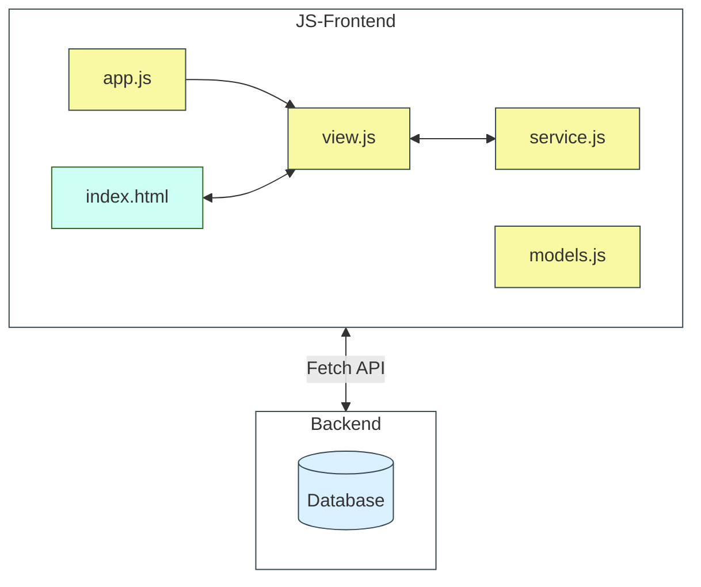

# JS-Frontend (Fortgeschritten)

Beispiel Applikation für ein JS-Frontend

## Start

1. Backend starten ( `java-rest-apis/slm-rest-api-x.x.x.jar)
2. `index.html` **MUSS** über einen Frontendserver geöffnet werden (Bsp. IntelliJ). Ein direktes Aufrufen im Browser ist per Design nicht möglich (CORS).   

## Beschreibung

**app.js:**
- Start der Applikation mittels _Revealing Module Pattern_

**view.js:**
- Schnittstelle HTML <-> Service
- Initialisierung und Rendering der View sowie Event-Handling

**model.js:**
- Beinhaltet die in der Applikation verwendeten JS-Klassen (z.B. Beer)

**service.js:**
- Fetch-API Service, das den Zugriff auf das Backend durchführt

## Themen

- [IIFE](https://developer.mozilla.org/en-US/docs/Glossary/IIFE) und Revealing Module Pattern
- [Event-Handling mit addEventListener(...)](https://developer.mozilla.org/en-US/docs/Web/API/EventTarget/addEventListener)
- [JS-Module](https://developer.mozilla.org/en-US/docs/Web/JavaScript/Guide/Modules)
  - [Import](https://developer.mozilla.org/en-US/docs/Web/JavaScript/Reference/Statements/import?retiredLocale=de)
  - [Export](https://developer.mozilla.org/en-US/docs/Web/JavaScript/Reference/Statements/export)
- [JS-Klassen](https://developer.mozilla.org/en-US/docs/Learn/JavaScript/Objects/Classes_in_JavaScript)
- [Fecth-API mit async/await](https://developer.mozilla.org/en-US/docs/Web/API/Fetch_API)
- [FormData](https://developer.mozilla.org/en-US/docs/Web/API/FormData?retiredLocale=de),
- [JSON](https://developer.mozilla.org/en-US/docs/Learn/JavaScript/Objects/JSON), 
- [Template Literals](https://developer.mozilla.org/en-US/docs/Web/JavaScript/Reference/Template_literals), 
- [Promises](https://developer.mozilla.org/en-US/docs/Web/JavaScript/Reference/Global_Objects/Promise), etc.

