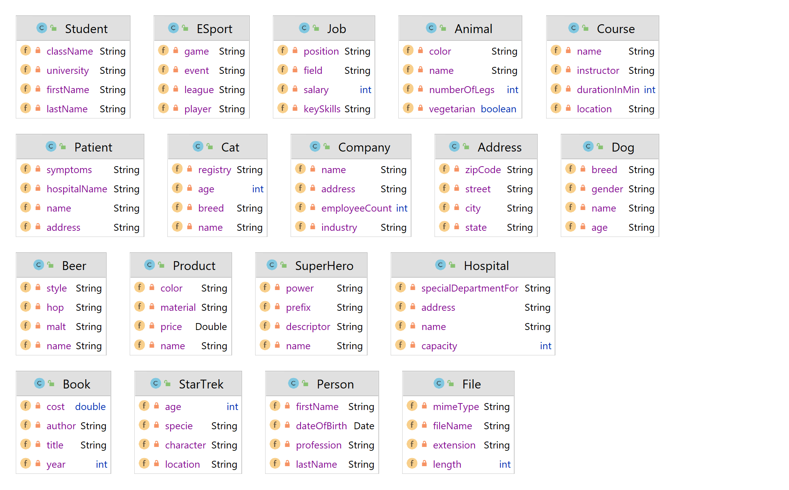

# README

stand: 2024-05-23
version: 1.0.2

## Beschreibung

Die Java Spring-Boot Applikation bietet 18 "REST" Endpoints mit sehr einfachen Model-Klassen. Beim Start der Applikation wird eine H2-In-Memory DB gestartet, in der, beim ersten Zugriff auf einen Endpoint, automatisch 50 Datensätze generiert werden.

## Build

```shell
mvnw package
```

## Run

```shell
java -jar slm-rest-api.x.x.x.jar 
```

## Model Klassen



## Verfügbare Endpoints


| #  | Endpoints                              |
| -- | -------------------------------------- |
| 1  | http://localhost:8080/api/v1/addresses |
| 2  | http://localhost:8080/api/v1/animals   |
| 3  | http://localhost:8080/api/v1/courses   |
| 4  | http://localhost:8080/api/v1/books     |
| 5  | http://localhost:8080/api/v1/companies |
| 6  | http://localhost:8080/api/v1/heros     |
| 7  | http://localhost:8080/api/v1/persons   |
| 8  | http://localhost:8080/api/v1/products  |
| 9  | http://localhost:8080/api/v1/esports   |
| 10 | http://localhost:8080/api/v1/dogs      |
| 11 | http://localhost:8080/api/v1/files     |
| 12 | http://localhost:8080/api/v1/startrek  |
| 13 | http://localhost:8080/api/v1/cats      |
| 14 | http://localhost:8080/api/v1/jobs      |
| 15 | http://localhost:8080/api/v1/students  |
| 16 | http://localhost:8080/api/v1/patients  |
| 17 | http://localhost:8080/api/v1/hospitals |
| 18 | http://localhost:8080/api/v1/beers     |

## Zugriff API


| HTTP-Methode | Endpoint                             | Beschreibung                                           |
| ------------ | ------------------------------------ | ------------------------------------------------------ |
| GET          | http://localhost:8080/api/v1/model   | Liefert alle Model-Objekte zurück (ohne paging)       |
| GET          | http://localhost:8080/api/v1/model/3 | Liefert das Model-Objekt mit der Id 3 zurück          |
| POST         | http://localhost:8080/api/v1/model   | Speichert das gesendete Model-Objekt in der DB         |
| PUT          | http://localhost:8080/api/v1/model/3 | Führt ein Update des Model-Objekts mit der Id 3 durch |
| DELETE       | http://localhost:8080/api/v1/model/3 | Löscht das Model-Objekt mit der Id 3                  |

## Auszug Response

```json
[
  {
    "name": "Vanguard",
    "hop": "Caramel",
    "malt": "Sapporo Premium",
    "style": "Stout",
    "id": 1
  },
  {
    "name": "Columbus",
    "hop": "Black malt",
    "malt": "90 Minute IPA",
    "style": "Light Lager",
    "id": 2
  },
  {
    "name": "Liberty",
    "hop": "Chocolate",
    "malt": "Westmalle Trappist Tripel",
    "style": "Scottish And Irish Ale",
    "id": 3
  }
]
```


## Support

Mail: schlag@spengergasse.at
