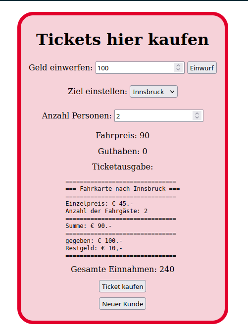

# 4AAIF, Praktische Leistungsfeststellung Javascript

## am 25. April 2024, Andreas Chwatal / Georg Graf

## Ticketautomat

In dieser Übung soll ein Ticketautomat entstehen, als Klasse. Er hat
folgende Eigenschaften:

Es gibt 2 Geldfächer:

1. #guthabenAktuellerKunde .. dies ist der "credit" des aktuellen Kunden
2. #gesamtEingenommen .. Dies ist der Speicher für alles eingenommene Geld.

- Im constructor gibt übergibt man, wieviel Geld (#gesamtEingenommen)
    ürsprünglich drinnen ist (in €), damit der Automat Restgeld geben kann.
- Man kann Geld `einwerfen()`, dies erhöht das Feld `#guthabenAktuellerKunde` um den eingeworfenen Betrag.
- Man kann das Fahrziel einstellen, in einem `select` Feld (Zeile s.u.)
- Man kann die Anzahl der Fahrgäste einstellen (1-10)
- man kann den Button `ticketKaufen()` drücken, dann wird ein Ticket oder eine Fehlermeldung in die `id` TicketAusgabe gedruckt.

Fahrziele und Preise:

`{"Salzbug":30,"Innsbruck":45,"Klagenfurt":40,"Graz":25,"Bregenz":60, "Linz": 25}`

(Obigen String können Sie in ein Objekt `ziele` speichern! `const ziele = {...}`)

## Aufgabe 1: Klassen Ticket und TicketAutomat

Erstelle für diese Aufgabe die folgenden 2 Klassen:

```plantuml
class TicketAutomat {
- #gesamtEingenommen: Number
- #guthabenAktuellerKunde: Number
- #ziel
- #anzahlPersonen
- #standort
- #ausgabe (get/set)
+ constructor(einnahmenInitial)
+ get gesamtEingenommen()
+ set gesamtEingenommen()
+ get eingeworfen()
+ einwerfen(Number)
+ zielEinstellen()
+ anzahlEinstellen()
+ ticketKaufen()
}
class Ticket {
- #anzahlPersonen
- #ziel
+ constructor(anzahl, ziel, gegeben)
+ toString()
}
TicketAutomat -> Ticket
```

Im `constructor(gesamtEingenommen)` sollen folgende Dinge passieren:

- `this.#gesamtEingenommen` soll auf den gegebenen Wert gesetzt werden, indem
    `setgesamtEingenommen()` aufgerufen wird.
- this.eingeworfen auf 0.
- this.ziel auf `undefined`

Weiters:

`zielEinstellen()` soll nur eines der oben genannten Ziele in die private
Variable `ziel` speichern können.

`anzahlEinstellen()` soll die Variable `#anzahlPersonen` setzen, sofern der
übergebene Wert gültig ist.

`ticketKaufen()` soll ein neues Ticket erstellen mit
`let ticket = new Ticket (ziel, anzahlPersonen, gegeben)`, soferne der
eingeworfene Betrag ausreicht. Im Fehlerfall soll eine Exception
geworfen werden. Mit `console.log(ticket.toString())` soll die Ausgabe auf die
Konsole erfolgen. Im erfolgreichen Fall wird das Feld `#gesamtEingenommen` des Automaten
um den Ticketpreis erhöht.

### Beispiel für ein Ticket

```text
===============================
=== Fahrkarte nach Salzburg ===
===============================
Einzelpreis: € 30.-
Anzahl der Fahrgäste: 3
===============================
Summe: € 90.-
===============================
gegeben: € 100.-
Restgeld: € 10,-
===============================
```

## Aufgabe 2: html Benutzeroberfläche

Eine Instanz der oben erstellten Klasse dient als "State" für die zu erstellende Applikation.
Die von Ihnen implementierten Methoden der Klasse dienen als State-Accessors bzw. State-Modificators,
somit übernimmt die Klasse die Punkte 1. sowie 2.

Elemente der Benutzeroberfläche (siehe auch Beispiel-Grafik unten):

- einwerfen (input type=numer ... submit)
- ziel einstellen (option / select)
- anzahl Personen einstellen
- Anzeige Fahrpreis (ändert sich bei Ziel Änderung oder Anzahl Änderung)
- Anzeige des Guthabens (ändert sich durch einwerfen
    `#guthabenAktuellerKunde`)
- Ausgabefeld des Tickets, dort kann auch angezeigt werden "Es fehlen noch XX
    € damit ich das Ticket drucken kann".
- Anzeige der gesamten Einnahmen des Automatens, ändert sich bei jedem
    Ticketkauf (`#gesamtEingenommen`)
- button "Ticket Kaufen" (wenn das Geld reicht wird Ticket gedruckt und die
    `#gesamtEingenommen` vergrößern sich entsprechend)

## *gutes Gelingen!*



## Rene Wenz' magisches 8 - Punkte - Programm

1.APPLICATION STATE

- Holds the state of the application
- This is the single source of truth for the application state

2.STATE ACCESSORS/MUTATORS FN'S

- Functions that allow us to get and set the state
- Here we will create functions to interact with the state

3.DOM Node Refs

- Static references to DOM nodes needed after the start of the application

4.DOM Node Creation Fn's

- Dynamic creation of DOM nodes needed upon user interaction
- Here we will possibly create a function that will create a new item

5.RENDER FN

- These functions will render the application state to the DOM
- IMPORTANT TAKEAWAY: The state drives the UI, any state change should trigger a re-render of the UI

6.EVENT HANDLERS

- These functions handle user interaction e.g. button clicks, key presses etc.
- These functions will call the state mutators and then call the render function
- The naming convention for the event handlers is `on<Event>`
- Here we will create a functions that will handle e.g. a "click" event on a button.

7.INIT BINDINGS

- These are the initial bindings of the event handlers, i.e. register the handlers of Pt. 6 with the DOM Node Refs of Pt. 3

8.INITIAL RENDER

- Here will call the render function (Pt. 5) to render the initial state of the application
